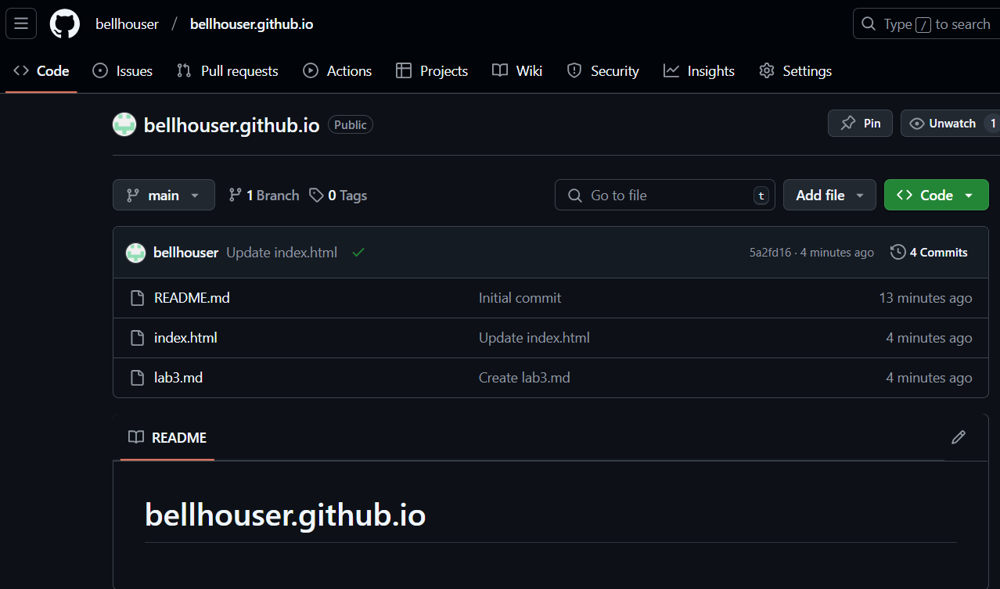
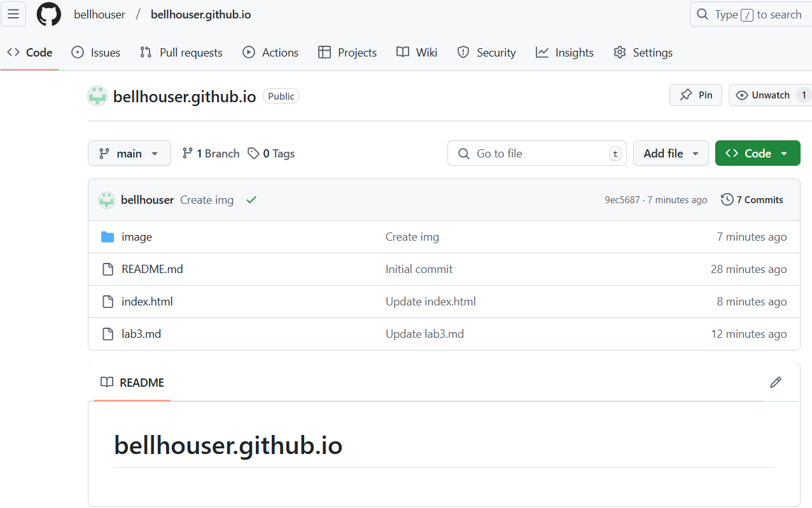
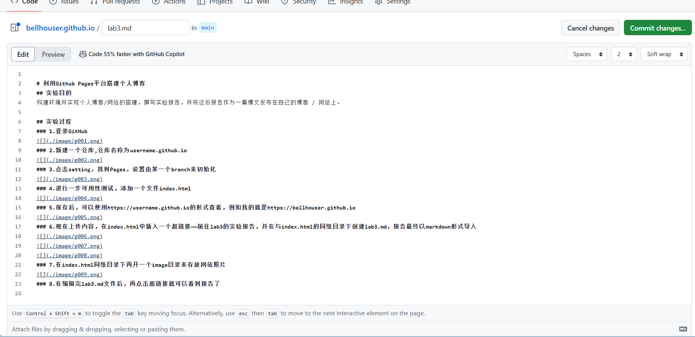
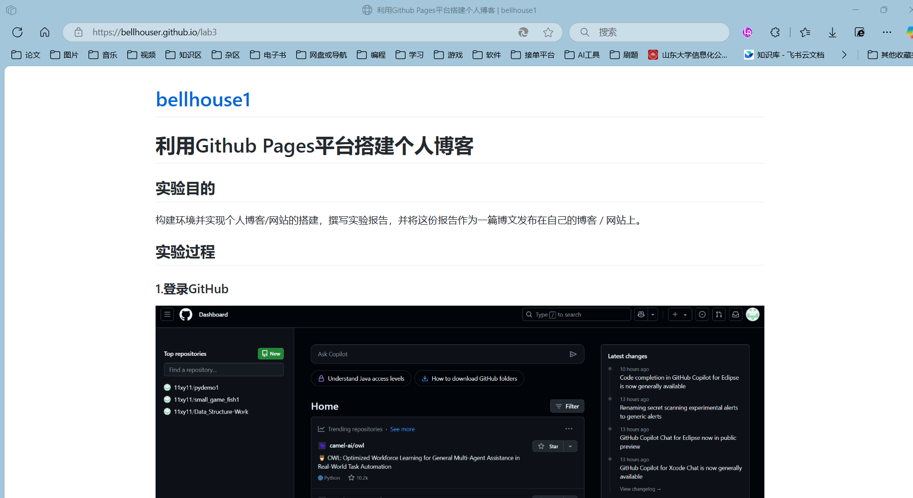

# 利用Github Pages平台搭建个人博客
## 实验目的
构建环境并实现个人博客/网站的搭建，撰写实验报告，并将这份报告作为一篇博文发布在自己的博客 / 网站上。

## 实验过程
### 1.登录GitHub

### 2.新建一个仓库,仓库名称为username.github.io

### 3.点击setting，找到Pages，设置由某一个branch来初始化

### 4.进行一步可用性测试，添加一个文件index.html

### 5.保存后，可以使用https://username.github.io的形式查看，例如我的就是https://bellhouser.github.io

### 6.现在上传内容，在index.html中插入一个超链接——前往lab3的实验报告，并在与index.html的同级目录下创建lab3.md，报告最终以markdown形式导入

### 7.在index.html同级目录下再开一个image目录来存放网站照片

### 8.在编辑完lab3.md文件后，再点击超链接就可以看到报告了

## 结论分析与体会
我在实验中依次完成了从注册GitHub账号、创建仓库到设置Pages并进行可用性测试等一系列操作，整个过程较为顺畅，体现了Github Pages服务对于初学者友好的特性。成功地在我的个人博客(https://bellhouser.github.io)上展示了实验报告，并实现了文件和图片的有效管理，证明了基于云服务部署网站的高效性和便捷性。在实验过程中，我对HTML基础语法以及Markdown语言有了初步掌握，为今后的学习和工作打下了良好的基础。
通过亲手搭建一个属于自己的网站，我深刻体会到了云计算带来的便利和技术魅力。它大大降低了个人或者小型团队发布信息的成本和难度。

