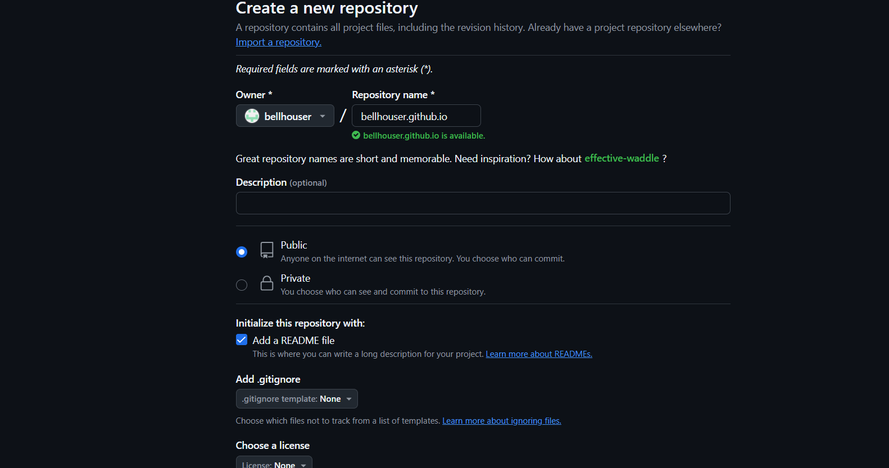
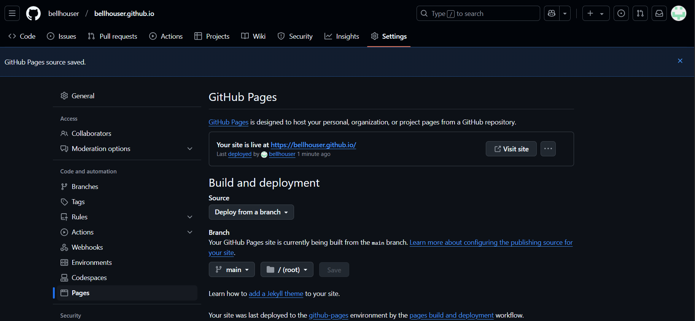
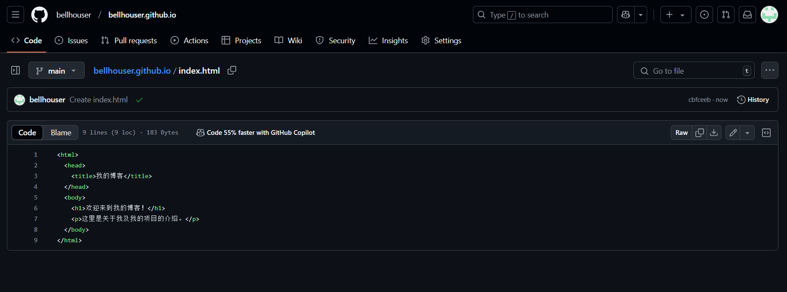
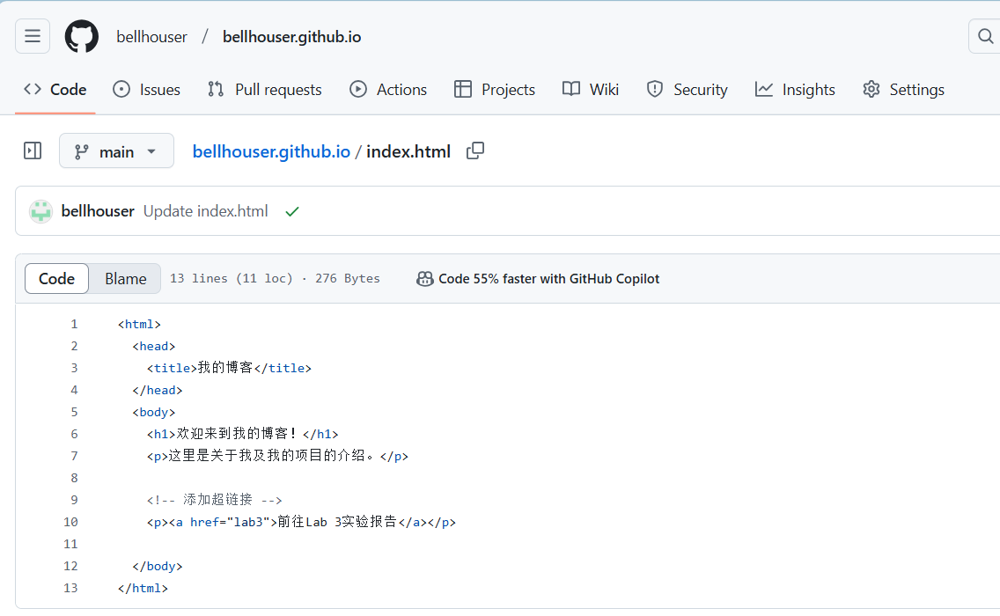

# 利用Github Pages平台搭建个人博客
## 实验目的
构建环境并实现个人博客/网站的搭建，撰写实验报告，并将这份报告作为一篇博文发布在自己的博客 / 网站上。

## 实验过程
### 1.登录GitHub

### 2.新建一个仓库,仓库名称为username.github.io

### 3.点击setting，找到Pages，设置由某一个branch来初始化

### 4.进行一步可用性测试，添加一个文件index.html

### 5.保存后，可以使用https://username.github.io的形式查看，例如我的就是https://bellhouser.github.io

### 6.现在上传内容，在index.html中插入一个超链接——前往lab3的实验报告，并在与index.html的同级目录下创建lab3.md，报告最终以markdown形式导入

